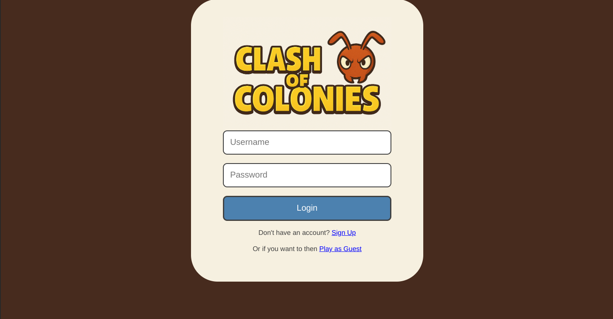

# Assignment 4
User login and signup for Clash of Colonies game

### Note
As my mid-term project is the same as my final project, I am submitting a greatly down version of the final project, as the professor directed. 
The MongoDB connection only works with a valid connection string in the .env. However, as according to Prof. Chu, it is bad practice to put that on a public repository, thus I have put the connection string as a comment to my submission.


### How to run
1. Run ```npm i``` on the root directory and the /frontend directory to install the necessary python modules
2. Activate the .venv 
3. Run ```npm start``` on the root directory to use the concurrently npm module to start both the backend and the frontend at the same time


## Backend Setup

### main.py
- defines the FastAPI router
- calls initialize_database on startup

### database.py
#### MyConfig
- takes the connect_string from the .env file, which needs to be located in the root folder of the project

#### initialize_database
- uses the connect_string to connect to the MongoDB database

### profile.py
#### Models
- ProfileBase pydantic model for handling log in and sign up with the frontend
- Profile Document type to store the full profile data
- User role enum
#### Routes
```@profileRouter.post('/register')```
- takes a username and a password
- checks first if the user already exists
- if not, creates a new profile with a distinct ID, **hashed password**, User role, and empty fields. Then inserts the new user and return success

```profileRouter.post('/login')```
- takes the user data associated with the inputted user name from the MongoDB database
- if user is found, verify the inputted password against the hashed password retrieved from the backend
- if successful, update the lastLoggedIn field from the user and return a successful status
 
##### routes relating to profile information
Routes are set up for getting, changing, and deleting the profile information of specific users. 

## Frontend Setup


### profileStore.ts
This module uses Zustand to handle the profile information and manage connection with the backend in an app wide-context

The store defines a separate ProfileData type which is used to sync up with the backend. Having a separate data type ensures that no validation occurs when sending information to the Pydantic-based backend.

#### fetchProfileInfo
- Uses the current `userID` from `useUserStore`
- Calls `GET /profiles/:userID` on the backend
- On success, sets the profile state in the store

#### updateProfile
- Sends a `PUT` request to `/profiles/:userID` with updated fields
- Accepts partial updates (e.g. only `name` or `email`)
- Logs results or errors to the console

### userStore.ts
As the user ID is crucial to the functioning of other components of the full game, it is handled by its own zustand store in addition to being a part of the profileStore.

### Welcome.tsx

- stores formData as a component state
- Allows users to log in, sign up, or play as a guest.
- Sends formData to the backend and updates the profile data of the global profile zustand store. 
- Normally uses `useNavigate` from React Router to redirect user to the dashboard, but for the purpose of this assignment, to the profile page


#### handleLogin

Sends a `POST` request to `/profiles/login` with the entered username and password. If the response is successful, it stores the user ID, fetches the user's profile, and navigates to the profile page. If login fails, it displays an error message.

#### handleSignUp

Triggered on sign-up form submission. This function sends a `POST` request to `/profiles/register` with the provided credentials. On success, it stores the new user ID, loads the user profile, and navigates to the profile page. If sign-up fails, it shows an error and falls back to guest mode.

#### handlePlayAsGuest

This function allows users to skip authentication. It sets the user ID to `"guest"` and immediately navigates to the profile page

## Profile.tsx
[profile](profile.png)
This page saves the profile data as part of its component state and updates the the information on the backend through a PUT call when the update button is clicked